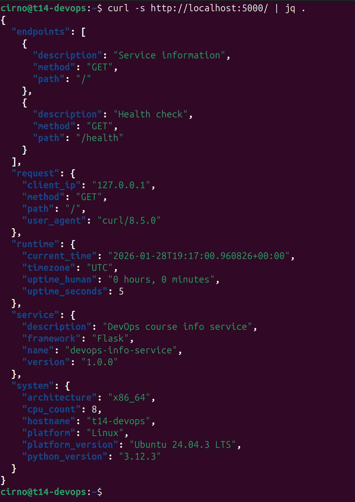
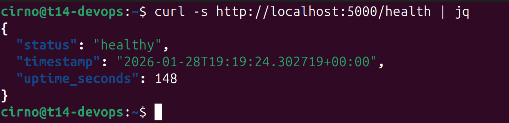
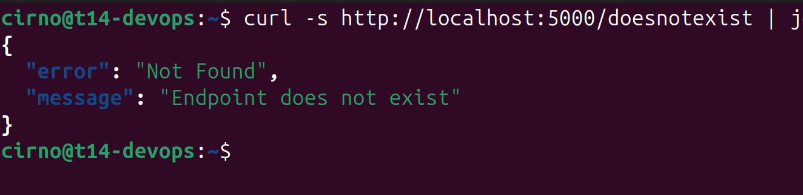

# Lab 1 — Implementation Report

## Framework Selection

I chose Flask for this project because I am most familiar with it.

Flask can be compared to another framework "FastAPI". It is similar to Flask in that both are minimal frameworks compared to another framework "Django". But FastAPI has more tools built-in compared to Flask, for example built-in async/await support, built-in API docs.

| | Flask | FastAPI | Django |
|-|-------|---------|--------|
| Size | Minimal | Minimal (but more than Flask) | Many |
| Builtin async support | No | Yes | No |
| Builtin automatic API documentation | No | Yes | No |
| Release year | 2010 | 2018 | 2005 |

## Best Practices Applied

### Single responsibility principle, clear function names

Single responsibility principle with clear functions names makes functions have only one purpose, that is clear from its name.

```python
@app.route("/")
def index():
    logger.info(
        f"Request: {request.method} {request.path} from {request.remote_addr}"
    )

    return jsonify(
        {
            "service": get_service_info(),
            "system": get_system_info(),
            "runtime": get_runtime_info(),
            "request": get_request_info(),
            "endpoints": get_endpoints(),
        }
    )
```

This allows easy unit testing of every function, and allows for more code reuse.

### No hardcoded values for deployment settings

No hardcoded values for deployment settings.

```bash
PORT=8080 HOST=0.0.0.0 DEBUG=false python app.py
```

This allows to change deployment settings without having to change the code and greatly simplifies deployment.

### Pinned dependencies

`requirements.txt` uses exact versions of packages instead of just package names.

```
Flask==3.1.0
```

This helps to avoid errors related to different versions of packages.

## API Documentation

### Main endpoint

```bash
curl -s http://localhost:5000/ | jq .
```

```json
{
  "endpoints": [
    {
      "description": "Service information",
      "method": "GET",
      "path": "/"
    },
    {
      "description": "Health check",
      "method": "GET",
      "path": "/health"
    }
  ],
  "request": {
    "client_ip": "127.0.0.1",
    "method": "GET",
    "path": "/",
    "user_agent": "curl/8.5.0"
  },
  "runtime": {
    "current_time": "2026-01-28T19:17:00.960826+00:00",
    "timezone": "UTC",
    "uptime_human": "0 hours, 0 minutes",
    "uptime_seconds": 5
  },
  "service": {
    "description": "DevOps course info service",
    "framework": "Flask",
    "name": "devops-info-service",
    "version": "1.0.0"
  },
  "system": {
    "architecture": "x86_64",
    "cpu_count": 8,
    "hostname": "t14-devops",
    "platform": "Linux",
    "platform_version": "Ubuntu 24.04.3 LTS",
    "python_version": "3.12.3"
  }
}
```

### Health endpoint

```bash
curl -s http://localhost:5000/health | jq
```

```json
{
  "status": "healthy",
  "timestamp": "2026-01-28T19:19:24.302719+00:00",
  "uptime_seconds": 148
}
```

### Non existent endpoint

```bash
curl -s http://localhost:5000/doesnotexist | jq
```

```json
{
  "error": "Not Found",
  "message": "Endpoint does not exist"
}
```

## Testing Evidence

- 
- 
- 

## Challenges & Solutions

### Python3 venv was not preinstalled on my system

Python 3 venv did not come preinstalled on Ubuntu 24.04 with zfsbootmenu, so I had to install it with the following command.

```bash
sudo apt install python3.12-venv
```

## GitHub Community

Starring repositories helps attract more users who might find the project helpful or attract potential project contributors. Also starring the repository makes it more likely that the project will be added to package repositories.
