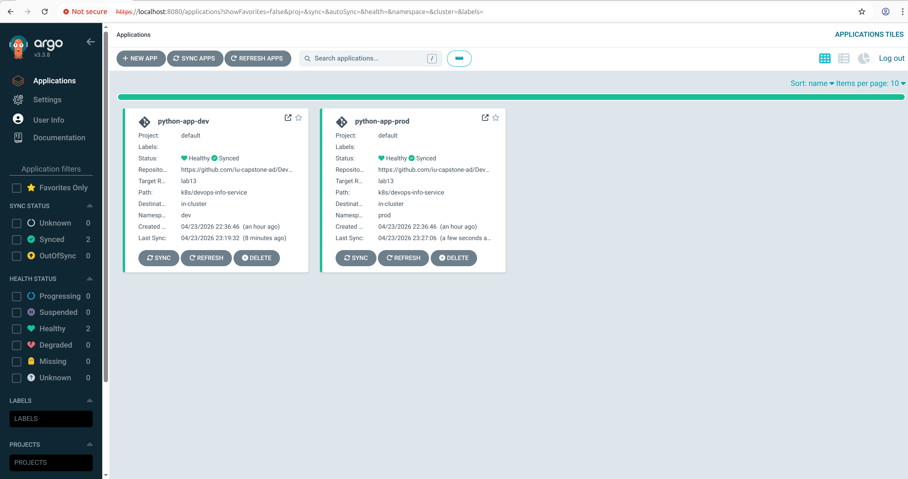
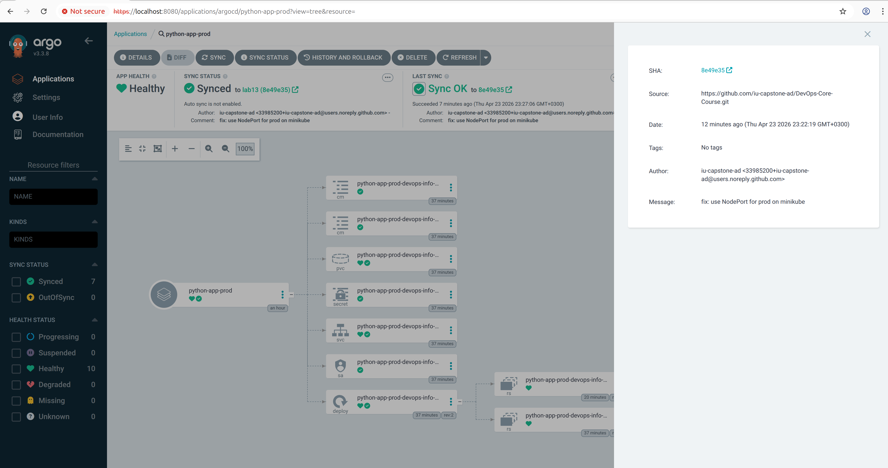
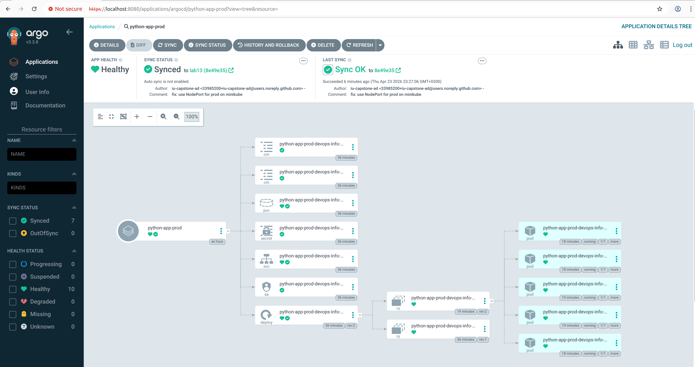

# Lab 13 - GitOps with ArgoCD

## ArgoCD Setup

Installed via Helm into the `argocd` namespace

```bash
helm repo add argo https://argoproj.github.io/argo-helm
helm repo update
kubectl create namespace argocd
helm install argocd argo/argo-cd --namespace argocd
```

All pods running

```
$ kubectl get pods -n argocd
NAME                                                READY   STATUS    RESTARTS      AGE
argocd-application-controller-0                     1/1     Running   1 (42m ago)   140m
argocd-applicationset-controller-559566846f-srpvz   1/1     Running   0             140m
argocd-dex-server-8f5687997-7lncx                   1/1     Running   0             140m
argocd-notifications-controller-56c7d65875-b6h99    1/1     Running   0             140m
argocd-redis-fcd76bcfb-gdn8h                        1/1     Running   0             140m
argocd-repo-server-7b8447858f-sz5pt                 1/1     Running   4 (42m ago)   140m
argocd-server-7f857f54f-rltzj                       1/1     Running   2 (87m ago)   140m
```

UI accessed via port-forward

```bash
kubectl port-forward svc/argocd-server -n argocd 8080:443
```

Admin password retrieved with

```bash
kubectl -n argocd get secret argocd-initial-admin-secret -o jsonpath="{.data.password}" | base64 -d
```

CLI login

```bash
argocd login localhost:8080 --insecure
```

## Application Configuration

### Manifests

Three Application manifests in `k8s/argocd/`:

`application.yaml` - base app, `default` namespace, `values.yaml`, manual sync.

`application-dev.yaml` - dev app, `dev` namespace, `values-dev.yaml`, auto-sync with prune and selfHeal.

`application-prod.yaml` - prod app, `prod` namespace, `values-prod.yaml`, manual sync.

All point to the Helm chart at `k8s/devops-info-service` on the `lab13` branch.
Source repository is `https://github.com/iu-capstone-ad/DevOps-Core-Course.git`.
Destination cluster is `https://kubernetes.default.svc`.

### Applied with

```bash
kubectl apply -f k8s/argocd/application-dev.yaml
kubectl apply -f k8s/argocd/application-prod.yaml
```

### Example Status

```
$ argocd app list
NAME                    CLUSTER                         NAMESPACE  PROJECT  STATUS  HEALTH   SYNCPOLICY  CONDITIONS  REPO                                                      PATH                     TARGET
argocd/python-app-dev   https://kubernetes.default.svc  dev        default  Synced  Healthy  Auto-Prune  <none>      https://github.com/iu-capstone-ad/DevOps-Core-Course.git  k8s/devops-info-service  lab13
argocd/python-app-prod  https://kubernetes.default.svc  prod       default  Synced  Healthy  Manual      <none>      https://github.com/iu-capstone-ad/DevOps-Core-Course.git  k8s/devops-info-service  lab13
```

### Dev app details

```
$ argocd app get python-app-dev
Name:               argocd/python-app-dev
Project:            default
Server:             https://kubernetes.default.svc
Namespace:          dev
URL:                https://argocd.example.com/applications/python-app-dev
Source:
- Repo:             https://github.com/iu-capstone-ad/DevOps-Core-Course.git
  Target:           lab13
  Path:             k8s/devops-info-service
  Helm Values:      values-dev.yaml
SyncWindow:         Sync Allowed
Sync Policy:        Automated (Prune)
Sync Status:        Synced to lab13 (8e49e35)
Health Status:      Healthy
```

## Multi-Environment

Dev and prod are separated by namespace and values file.

Dev (`values-dev.yaml`): 1 replica, 50m/64Mi requests, 100m/128Mi limits, NodePort 30081, auto-sync, prune, selfHeal.

Prod (`values-prod.yaml`): 5 replicas, 200m/256Mi requests, 500m/512Mi limits, NodePort 30082, manual sync.

Dev has auto-sync, any git push triggers deployment, manual cluster changes get reverted.

Prod uses manual sync -- production deployments go through a review step for controlled release timing and rollback planning.

Dev pods:

```
$ kubectl get pods -n dev
NAME                                                 READY   STATUS    RESTARTS   AGE
python-app-dev-devops-info-service-f77df788b-dds54   1/1     Running   0          65m
```

Prod pods:

```
$ kubectl get pods -n prod
NAME                                                   READY   STATUS    RESTARTS   AGE
python-app-prod-devops-info-service-6b44687dff-29nv2   1/1     Running   0          27m
python-app-prod-devops-info-service-6b44687dff-5k7nv   1/1     Running   0          27m
python-app-prod-devops-info-service-6b44687dff-cr58x   1/1     Running   0          28m
python-app-prod-devops-info-service-6b44687dff-jw825   1/1     Running   0          28m
python-app-prod-devops-info-service-6b44687dff-swczs   1/1     Running   0          27m
```

## Self-Healing Evidence

### Manual scale test

Scaled dev deployment manually:

```bash
kubectl scale deployment python-app-dev-devops-info-service -n dev --replicas=5
```

ArgoCD detected the drift and reverted changed replicas count to 1. The `selfHeal` policy ensures the cluster state matches git.

### Pod deletion test

```bash
kubectl delete pod -n dev -l app.kubernetes.io/name=devops-info-service
```

The pod was recreated after deletion. Kubernetes maintains the pod count regardless of ArgoCD.

### Configuration drift test

Added a label manually:

```bash
kubectl label deployment python-app-dev-devops-info-service -n dev test-label=manual
```

ArgoCD detected the label as drift and removed it on the next self-heal cycle. The diff was visible via `argocd app diff python-app-dev`.

### ArgoCD sync vs Kubernetes healing

Kubernetes self-healing: ReplicaSet restarts crashed pods and keeps replica count. Happens instantly.

ArgoCD self-healing: reverts cluster states different from git (replica count, labels, resource limits). Polls git every 3 minutes by default.

## Screenshots

### ArgoCD UI showing both applications



### Sync status



### Application details view


