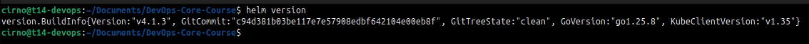
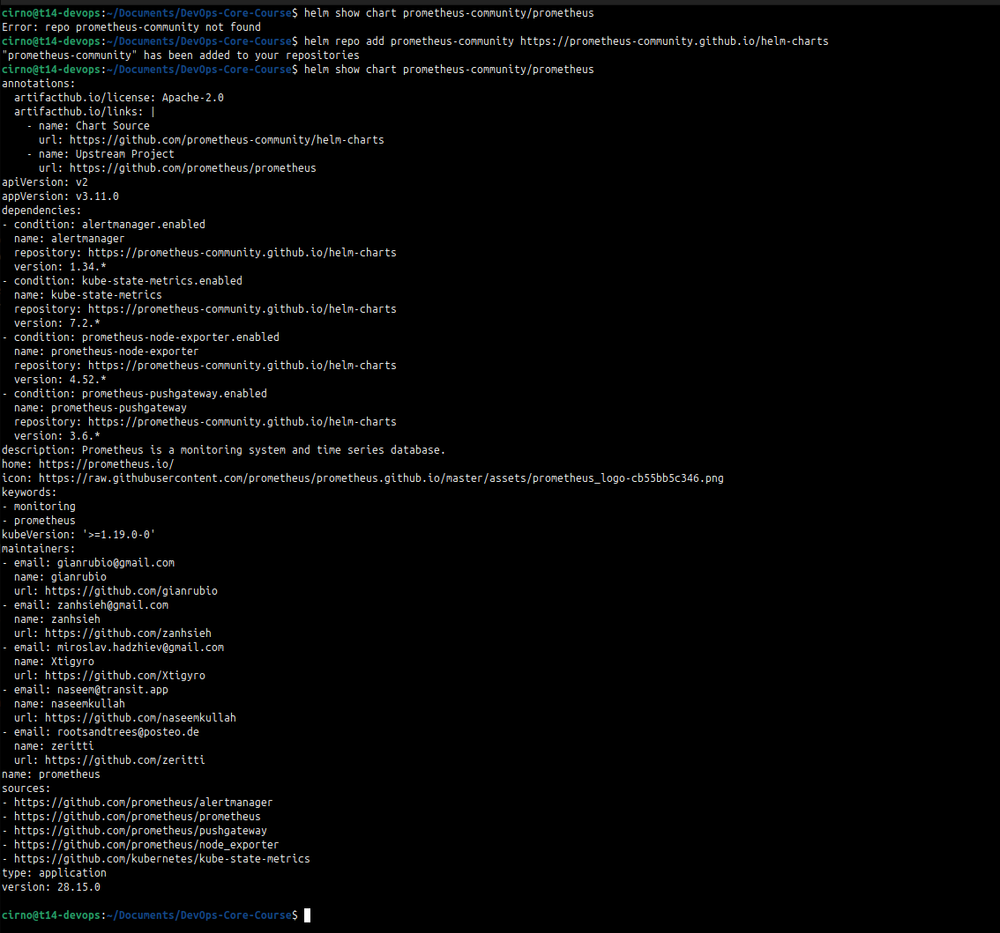
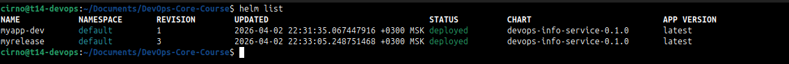
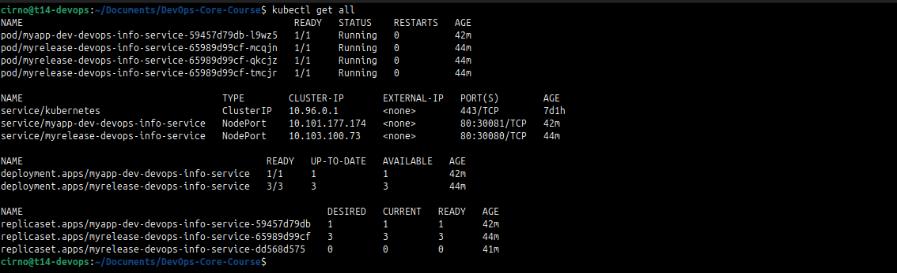
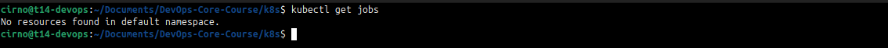
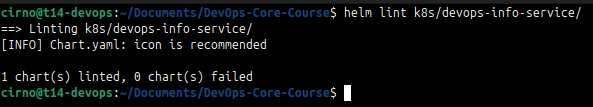
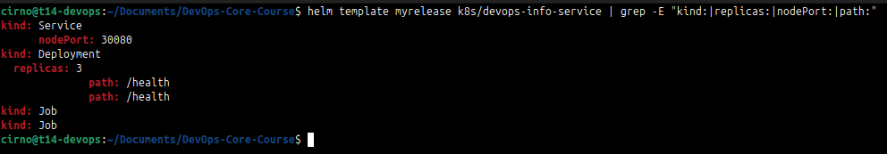
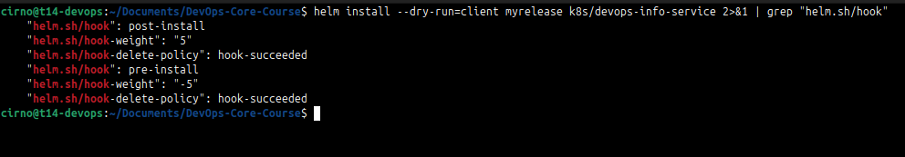
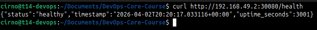

# Lab 10 - Helm Package Manager

## Task 1

### Helm version

```
$ helm version
version.BuildInfo{Version:"v4.1.3", GitCommit:"c94d381b03be117e7e57908edbf642104e00eb8f", GitTreeState:"clean", GoVersion:"go1.25.8", KubeClientVersion:"v1.35"}
```



### Helm chart

```
$ helm repo add prometheus-community https://prometheus-community.github.io/helm-charts
"prometheus-community" has been added to your repositories
$ helm show chart prometheus-community/prometheus
annotations:
  artifacthub.io/license: Apache-2.0
  artifacthub.io/links: |
    - name: Chart Source
      url: https://github.com/prometheus-community/helm-charts
    - name: Upstream Project
      url: https://github.com/prometheus/prometheus
apiVersion: v2
appVersion: v3.11.0
```



### Helm's value propositions

Helm allows for a simplified deployment and allows code reuse through templates.

## Chart Overview

Chart at `k8s/devops-info-service/`

```
k8s/devops-info-service/
- Chart.yaml
- values.yaml
- values-dev.yaml
- values-prod.yaml
- templates/
  - _helpers.tpl
  - deployment.yaml
  - service.yaml
  - NOTES.txt
  - hooks/
    - pre-install-job.yaml
    - post-install-job.yaml
```

`_helpers.tpl` defines `fullname`, `labels`, and `selectorLabels` used by all templates.

`deployment.yaml` pulls image, replicas, resources, and probe config from values.

`service.yaml` emits `nodePort` only when type is NodePort.

Values are organized by concern: `image`, `service`, `resources`, `livenessProbe`, `readinessProbe`, `strategy`. Defaults match the original Lab 9 manifests (3 replicas, NodePort 30080).

## Configuration Guide

Key values in `values.yaml`:

| Value | Default | Purpose |
|---|---|---|
| replicaCount | 3 | pod count |
| image.repository | iucapstonead/devops-info-service | image |
| image.tag | latest | image tag |
| service.type | NodePort | service type |
| service.nodePort | 30080 | external port |
| resources.* | 100m/128Mi req, 200m/256Mi lim | cpu/mem |
| livenessProbe.initialDelaySeconds | 10 | startup grace |
| readinessProbe.initialDelaySeconds | 5 | readiness grace |

`values-dev.yaml`: 1 replica, halved resources, shorter probe delays.
`values-prod.yaml`: 5 replicas, doubled resources, longer liveness delay (30s).

### DEV

```bash
helm install myapp-dev k8s/devops-info-service -f k8s/devops-info-service/values-dev.yaml --set service.nodePort=30081
```

### PROD

```bash
helm install myapp-prod k8s/devops-info-service -f k8s/devops-info-service/values-prod.yaml --set service.type=NodePort --set service.nodePort=30082
```

## Hook Implementation

Two hooks, both busybox jobs with `restartPolicy: Never` and `hook-succeeded` deletion policy.

`pre-install-job.yaml` (weight -5): runs before any chart resource is created. Validates
environment, prints namespace. Simulates a pre-flight check.

`post-install-job.yaml` (weight 5): runs after all resources are ready. Simulates a smoke
test with a short sleep then exit 0.

Hook weights control order within the same hook event: lower runs first. Both hooks use
`hook-succeeded` so the Job object is deleted automatically after success, keeping the
namespace clean.

## Installation Evidence

### helm list

```
$ helm list
NAME     	NAMESPACE	REVISION	UPDATED                                	STATUS  	CHART                    	APP VERSION
myapp-dev	default  	1       	2026-04-02 22:31:35.067447916 +0300 MSK	deployed	devops-info-service-0.1.0	latest     
myrelease	default  	3       	2026-04-02 22:33:05.248751468 +0300 MSK	deployed	devops-info-service-0.1.0	latest
```



### kubectl get all

```
$ kubectl get all
NAME                                                 READY   STATUS    RESTARTS   AGE
pod/myapp-dev-devops-info-service-59457d79db-l9wz5   1/1     Running   0          42m
pod/myrelease-devops-info-service-65989d99cf-mcqjn   1/1     Running   0          44m
pod/myrelease-devops-info-service-65989d99cf-qkcjz   1/1     Running   0          44m
pod/myrelease-devops-info-service-65989d99cf-tmcjr   1/1     Running   0          44m

NAME                                    TYPE        CLUSTER-IP       EXTERNAL-IP   PORT(S)        AGE
service/kubernetes                      ClusterIP   10.96.0.1        <none>        443/TCP        7d1h
service/myapp-dev-devops-info-service   NodePort    10.101.177.174   <none>        80:30081/TCP   42m
service/myrelease-devops-info-service   NodePort    10.103.100.73    <none>        80:30080/TCP   44m

NAME                                            READY   UP-TO-DATE   AVAILABLE   AGE
deployment.apps/myapp-dev-devops-info-service   1/1     1            1           42m
deployment.apps/myrelease-devops-info-service   3/3     3            3           44m

NAME                                                       DESIRED   CURRENT   READY   AGE
replicaset.apps/myapp-dev-devops-info-service-59457d79db   1         1         1       42m
replicaset.apps/myrelease-devops-info-service-65989d99cf   3         3         3       44m
replicaset.apps/myrelease-devops-info-service-dd568d575    0         0         0       41m
```



### Hook jobs

Jobs ran and were deleted on success per `hook-succeeded` policy:

```
$ kubectl get jobs
No resources found in default namespace.
```



To view hooks live run `kubectl get jobs -w` during install.

### Dev vs prod

Dev install: 1 pod, 30081, 50m/64Mi requests.
Prod upgrade: 5 pods, 200m/256Mi requests, `initialDelaySeconds: 30` for liveness.

After rollback to revision 1: back to 3 replicas.

## Operations

### Install

```bash
helm install myrelease k8s/devops-info-service
```

### Upgrade

```bash
helm upgrade myrelease k8s/devops-info-service -f k8s/devops-info-service/values-prod.yaml
```

### Rollback

```bash
helm rollback myrelease 1
```

### Uninstall

```bash
helm uninstall myrelease
```

## Testing & Validation

### helm lint

```
$ helm lint k8s/devops-info-service
==> Linting k8s/devops-info-service
[INFO] Chart.yaml: icon is recommended

1 chart(s) linted, 0 chart(s) failed
```



### helm template

```
$ helm template myrelease k8s/devops-info-service | grep -E "kind:|replicas:|nodePort:|path:"
kind: Service
      nodePort: 30080
kind: Deployment
  replicas: 3
              path: /health
              path: /health
kind: Job
kind: Job
```



### dry-run

```
$ helm install --dry-run=client myrelease k8s/devops-info-service 2>&1 | grep "helm.sh/hook"
    "helm.sh/hook": post-install
    "helm.sh/hook-weight": "5"
    "helm.sh/hook-delete-policy": hook-succeeded
    "helm.sh/hook": pre-install
    "helm.sh/hook-weight": "-5"
    "helm.sh/hook-delete-policy": hook-succeeded
```



### app access

```
$ curl http://192.168.49.2:30080/health
{"status":"healthy","timestamp":"2026-04-02T20:20:17.033116+00:00","uptime_seconds":3001}
```


