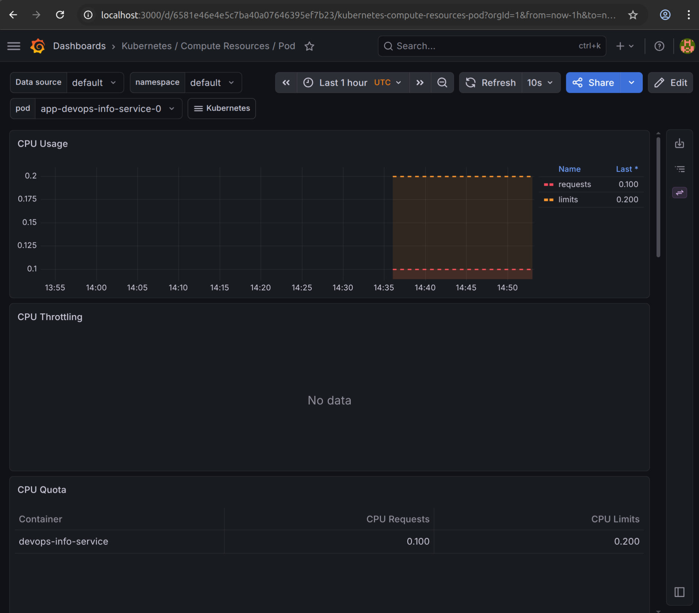
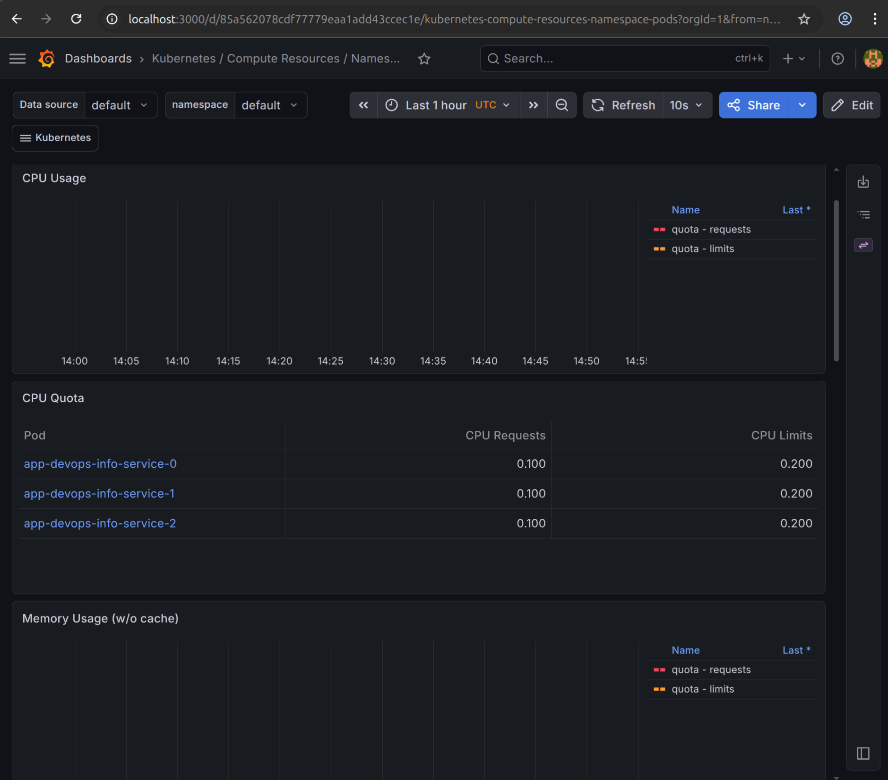
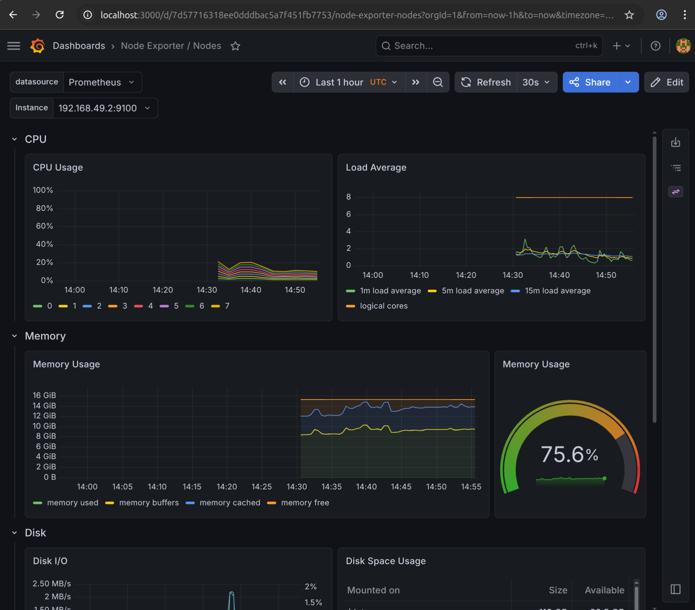
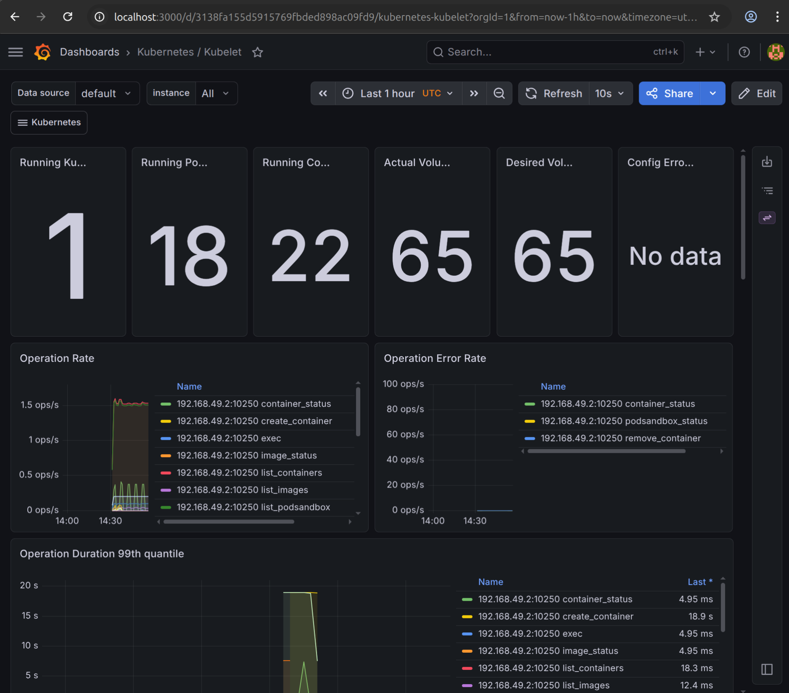
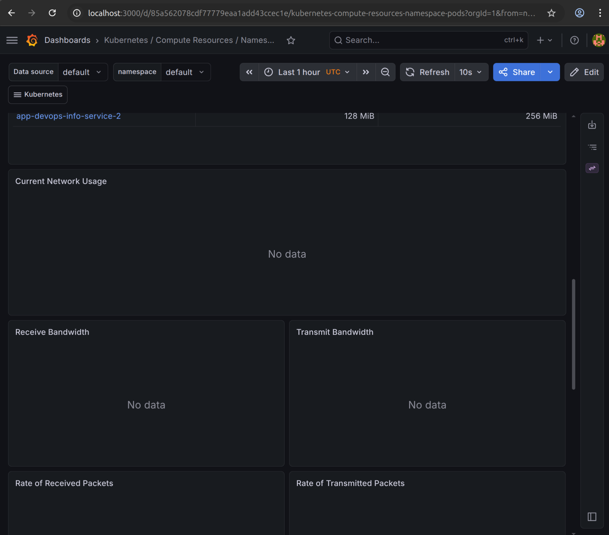
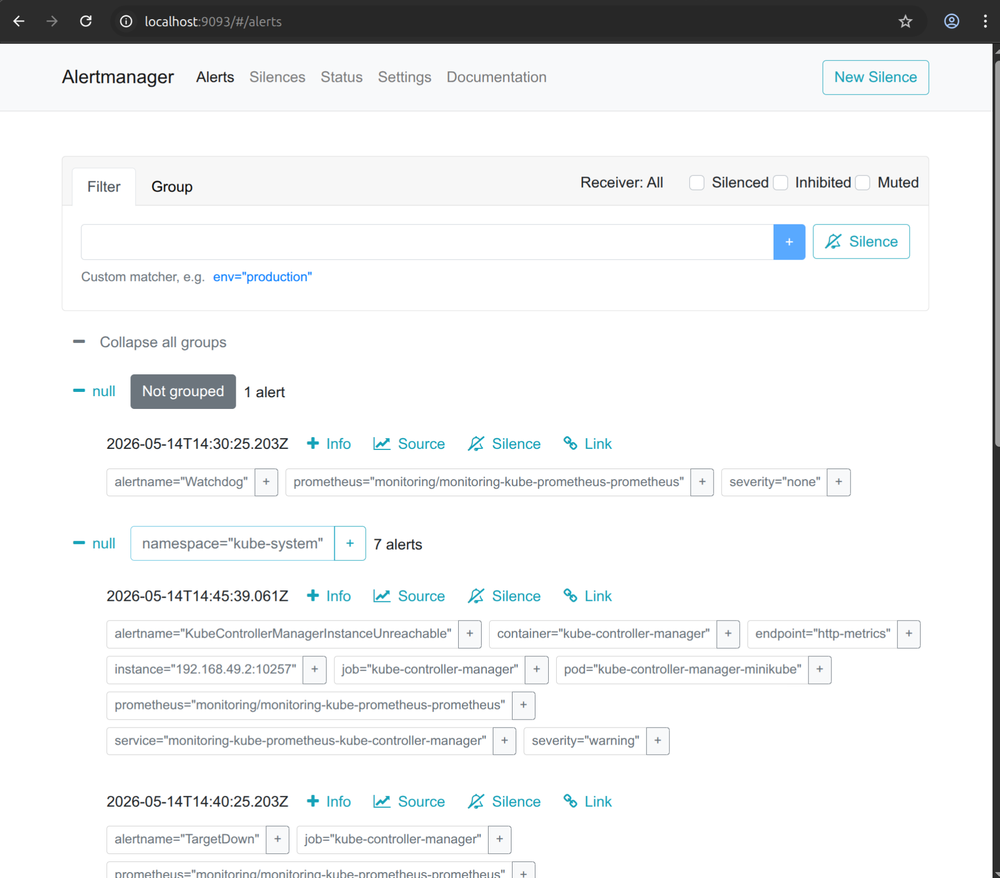

# Lab 16 - Kubernetes Monitoring and Init Containers

## Stack Components

Prometheus Operator - manages Prometheus and Alertmanager instances in the cluster using custom resources. It automates configuration and lifecycle of monitoring components.

Prometheus - collects and stores metrics from cluster components and applications by scraping HTTP endpoints. It provides PromQL query language for analysis.

Alertmanager - handles alerts sent by Prometheus. It groups, deduplicates, and routes alerts to receivers like email.

Grafana - visualization tool that connects to Prometheus as data source and provides pre-built dashboards for cluster monitoring.

kube-state-metrics - generates metrics about the state of Kubernetes objects like deployments, pods, and nodes. It listens to the Kubernetes API and exposes this data for Prometheus.

node-exporter - runs on each node as a DaemonSet and exposes hardware and OS level metrics like CPU, memory, disk, and network usage.

## Installation Evidence

```
$ kubectl get po,svc -n monitoring
NAME                                                         READY   STATUS    RESTARTS   AGE
pod/alertmanager-monitoring-kube-prometheus-alertmanager-0   2/2     Running   0          3m26s
pod/monitoring-grafana-fdbd89857-qmhhj                       3/3     Running   0          4m20s
pod/monitoring-kube-prometheus-operator-59754b75c4-fnm65     1/1     Running   0          4m20s
pod/monitoring-kube-state-metrics-5957bd45bc-vkpcv           1/1     Running   0          4m20s
pod/monitoring-prometheus-node-exporter-4rlgv                1/1     Running   0          4m20s
pod/prometheus-monitoring-kube-prometheus-prometheus-0       2/2     Running   0          3m25s

NAME                                              TYPE        CLUSTER-IP       EXTERNAL-IP   PORT(S)                      AGE
service/alertmanager-operated                     ClusterIP   None             <none>        9093/TCP,9094/TCP,9094/UDP   3m26s
service/monitoring-grafana                        ClusterIP   10.96.61.207     <none>        80/TCP                       4m20s
service/monitoring-kube-prometheus-alertmanager   ClusterIP   10.100.113.228   <none>        9093/TCP,8080/TCP            4m20s
service/monitoring-kube-prometheus-operator       ClusterIP   10.106.229.254   <none>        443/TCP                      4m20s
service/monitoring-kube-prometheus-prometheus     ClusterIP   10.104.137.123   <none>        9090/TCP,8080/TCP            4m20s
service/monitoring-kube-state-metrics             ClusterIP   10.97.241.162    <none>        8080/TCP                     4m20s
service/monitoring-prometheus-node-exporter       ClusterIP   10.101.13.96     <none>        9100/TCP                     4m20s
service/prometheus-operated                       ClusterIP   None             <none>        9090/TCP                     3m25s
```

## Dashboard Answers

### 1. Pod Resources - StatefulSet CPU and memory usage

Dashboard: Kubernetes / Compute Resources / Pod

\

### 2. Namespace Analysis - pods with most and least CPU in default namespace

Dashboard: Kubernetes / Compute Resources / Namespace (Pods)

\

### 3. Node Metrics - memory usage and CPU cores

Dashboard: Node Exporter / Nodes

\

### 4. Kubelet - pods and containers managed

Dashboard: Kubernetes / Kubelet

\

### 5. Network - traffic for pods in default namespace

Dashboard: Kubernetes / Compute Resources / Namespace (Pods), network section

Network metrics are not available on Minikube with the default Container Network Interface (CNI). Prometheus returns empty results for these metrics. This is a limitation of Minikube, cAdvisor does not expose per-pod network counters.

\

### 6. Alerts - active alerts

Dashboard: Alertmanager UI at port 9093



## Init Containers

### Download Init Container

File: `k8s/init-download.yaml`

The init container uses wget to download `https://example.com` and saves it to a shared emptyDir volume. The main container then reads the file from `/data/index.html`.

```
$ kubectl apply -f k8s/init-download.yaml
pod/init-download-demo created

$ kubectl logs init-download-demo -c init-download
Connecting to example.com (172.66.147.243:443)
wget: note: TLS certificate validation not implemented
saving to '/work-dir/index.html'
index.html           100% |********************************|   528  0:00:00 ETA
'/work-dir/index.html' saved

$ kubectl exec init-download-demo -- cat /data/index.html
<!doctype html><html lang="en"><head><title>Example Domain</title>...
```

### Wait-for-Service Pattern

File: `k8s/init-wait-for-service.yaml`

The init container runs nslookup in a loop until the service `myservice` is resolvable via DNS. Once the service is available, the main container starts.

```
$ kubectl apply -f k8s/init-wait-for-service.yaml
pod/init-wait-demo created
service/myservice created

$ kubectl get pod init-wait-demo
NAME             READY   STATUS     RESTARTS   AGE
init-wait-demo   0/1     Init:0/1   0          17s

$ kubectl logs init-wait-demo -c wait-for-service
Server:		10.96.0.10
Address:	10.96.0.10:53

Name:	myservice.default.svc.cluster.local
Address: 10.106.51.101
```
