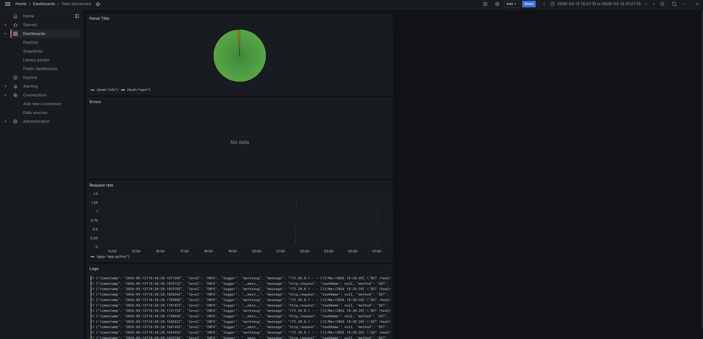
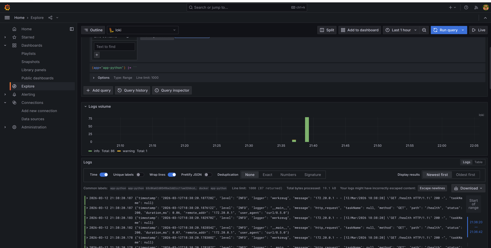
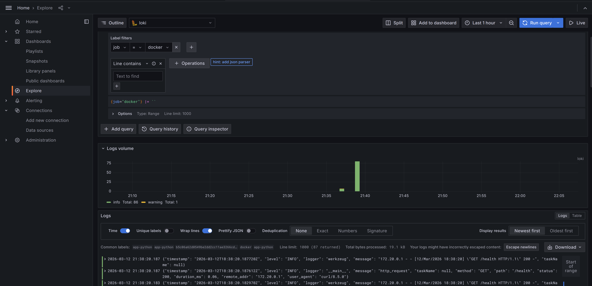
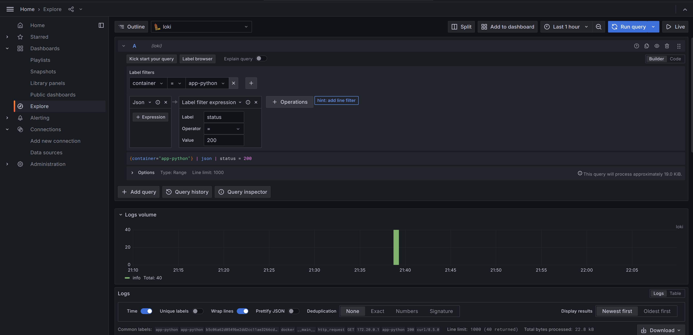
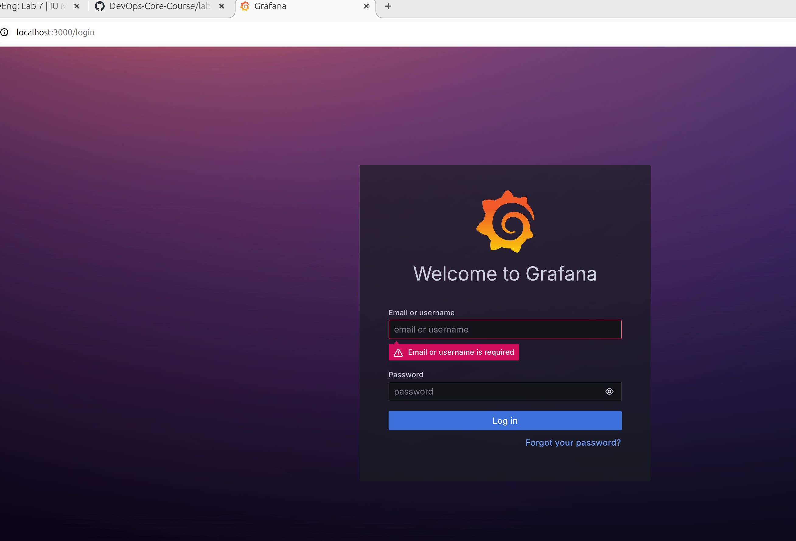

# Lab 07 - Loki Stack: Centralized Logging

## Architecture

```
app-python -> logs -> stdout -> promtail -> loki -> grafana
```

All services share a Docker network `logging`. Promtail discovers containers via the Docker socket using label `logging=promtail`.

## Setup Guide

```bash
cd monitoring
docker compose up -d
docker compose ps
```

```
NAME         IMAGE                    COMMAND                  SERVICE      CREATED          STATUS                    PORTS
app-python   monitoring-app-python    "python app.py"          app-python   35 minutes ago   Up 35 minutes             0.0.0.0:8000->5000/tcp, [::]:8000->5000/tcp
grafana      grafana/grafana:10.4.2   "/run.sh"                grafana      35 minutes ago   Up 34 minutes (healthy)   0.0.0.0:3000->3000/tcp, [::]:3000->3000/tcp
loki         grafana/loki:3.0.0       "/usr/bin/loki -conf…"   loki         35 minutes ago   Up 34 minutes (healthy)   0.0.0.0:3100->3100/tcp, [::]:3100->3100/tcp
promtail     grafana/promtail:3.0.0   "/usr/bin/promtail -…"   promtail     35 minutes ago   Up 34 minutes
```

Add Loki as a datasource in Grafana:

1. Go to Connections -> Data sources -> Add data source
2. Select Loki
3. URL: `http://loki:3100`
4. Click Save & Test

## Configuration

### Loki

`loki/config.yml`

- `schema: v13` latest stable TSDB schema
- `store tsdb` better query performance vs boltdb-shipper
- `retention_period 168h (7 days)` reasonable dev retention
- `auth_enabled false` single-tenant local setup

```yaml
schema_config:
  configs:
    - from: 2024-01-01
      store: tsdb
      object_store: filesystem
      schema: v13
      index:
        prefix: index_
        period: 24h
```

Compactor is enabled with `retention_enabled: true` so old logs get cleaned up after the retention period.

### Promtail

`promtail/config.yml`

- Uses `docker_sd_configs` to discover containers via Docker socket
- Filters containers by label `logging=promtail`
- Relabels `__meta_docker_container_name` -> `container` (strips leading `/`)
- Relabels `__meta_docker_container_label_app` -> `app`
- Sets `job=docker` for all scraped logs

Key snippet:

```yaml
scrape_configs:
  - job_name: docker
    docker_sd_configs:
      - host: unix:///var/run/docker.sock
        refresh_interval: 5s
        filters:
          - name: label
            values: ["logging=promtail"]
```

## Application Logging

Custom `JSONFormatter` class in `app.py` outputs structured JSON logs to stdout. `@app.before_request` and `@app.after_request` hooks log every HTTP request with method, path, status, duration_ms, remote_addr, and user_agent. No extra pip dependencies -- uses stdlib `json` and `logging`.

Sample output from `docker compose logs app-python --tail=5`:

```
app-python  | {"timestamp": "2026-03-12T18:38:20.168143Z", "level": "INFO", "logger": "__main__", "message": "http_request", "taskName": null, "method": "GET", "path": "/health", "status": 200, "duration_ms": 0.06, "remote_addr": "172.20.0.1", "user_agent": "curl/8.5.0"}
```

Loki can parse these fields with the `| json` pipeline.

## Dashboard

Created a dashboard with 4 panels:

### Log volume

`rate({job="docker"}[1m])` as time series

### Log stream

`{container="app-python"}` as logs panel

### HTTP status distribution

`{container="app-python"} | json | status != ""` grouped by status

### Error logs

`{container="app-python"} | json | level="ERROR"` as logs panel



### LogQL queries used

Logs from app-python only:

```
{container="app-python"}
```



All docker logs:

```
{job="docker"}
```



HTTP requests with status filter:

```
{container="app-python"} | json | status >= 400
```



## Production Config

### Resource limits

All services have CPU and memory limits set via `deploy.resources.limits` in docker-compose.yml:

#### loki

```yaml
limits:
  cpus: "0.5"
  memory: 256M
```

#### promtail

```yaml
limits:
  cpus: "0.25"
  memory: 128M
```

#### grafana

```yaml
limits:
  cpus: "0.5"
  memory: 256M
```

#### app-python

```yaml
limits:
  cpus: "0.25"
  memory: 128M
```

### Health checks

Loki and Grafana have `healthcheck` sections that check `/ready` and `/api/health` endpoints. Promtail requires healthy Loki to start.

### Security

Anonymous access is disabled. Grafana admin password is set via `.env` file. The `.env` is listed in `.gitignore`.



### Retention

Log retention is set to 7 days. The compactor runs with `retention_delete_delay: 2h`.

## Testing

Verify Loki is ready

```bash
curl http://localhost:3100/ready
```

Generate traffic

```bash
curl http://localhost:8000/
curl http://localhost:8000/health
```

Check app logs are JSON

```bash
docker compose logs app-python --tail=5
```

Verify all services are up

```bash
docker compose ps
```

## Challenges

No challenges while solving the lab.
