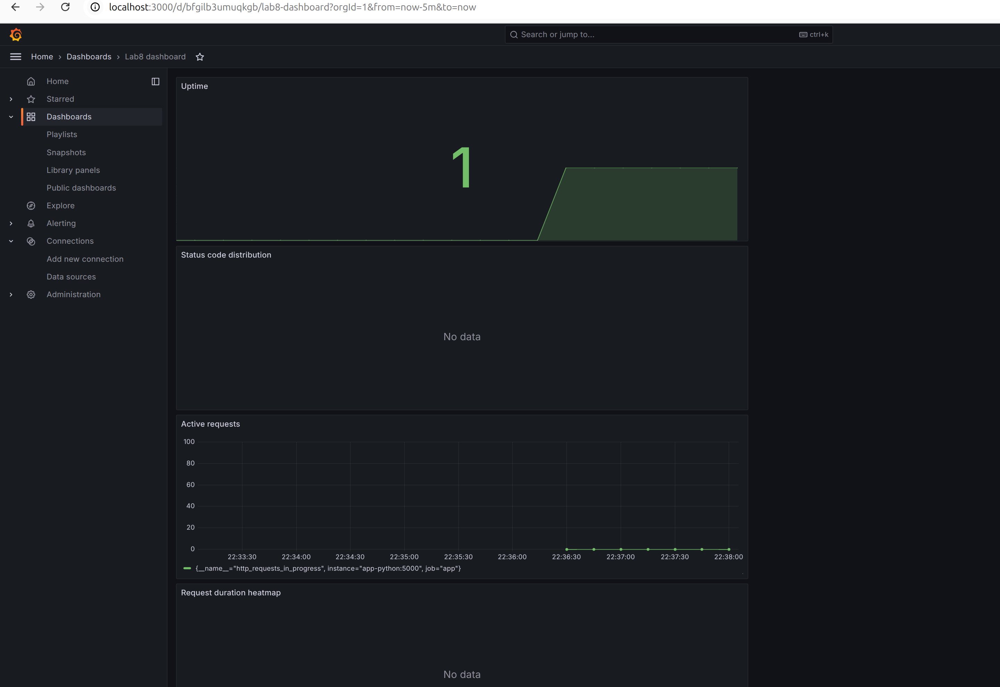
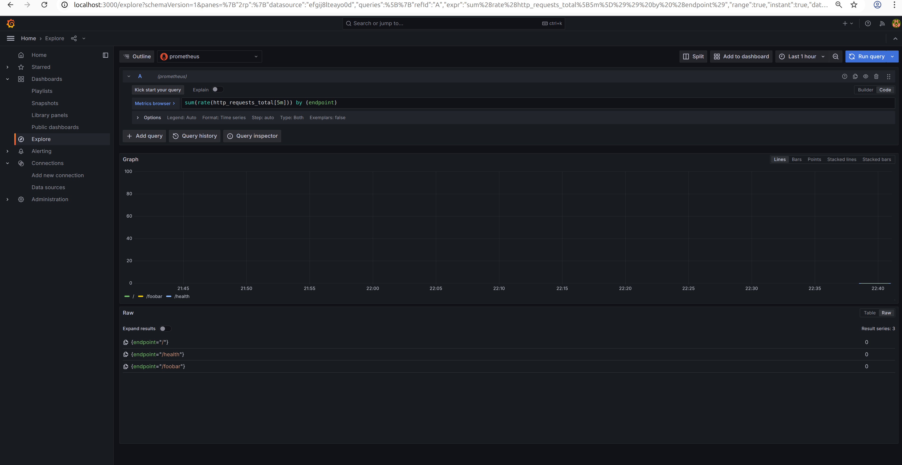
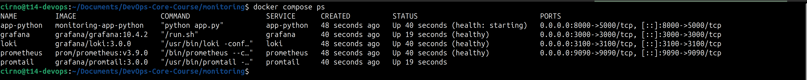
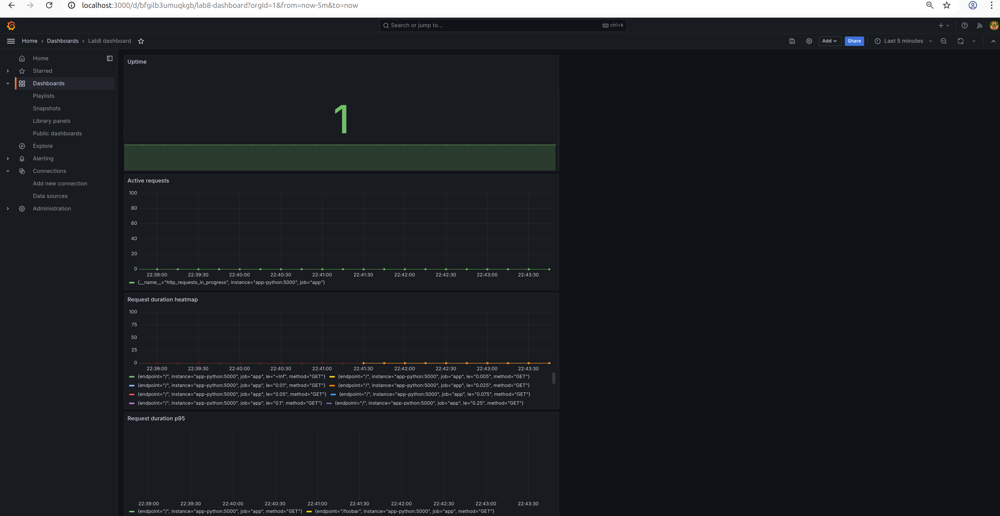
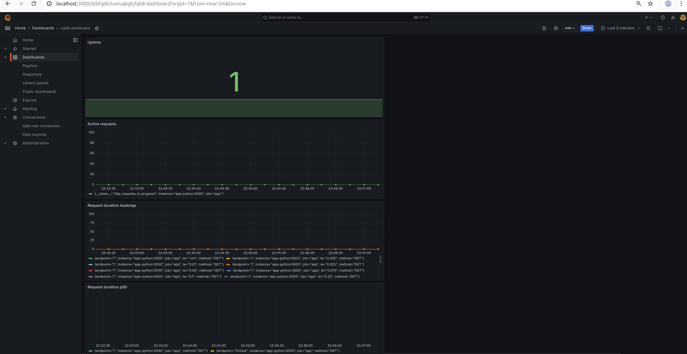

# Lab 08 - Prometheus: Metrics & Monitoring

## Architecture

```
app-python -> /metrics -> prometheus -> grafana
                              |
                loki -------> |
                grafana ----> |
                prometheus -> |
```

Prometheus scrapes all services every 15 seconds. Grafana queries Prometheus for dashboards. All services share the `logging` Docker network from Lab 07.

## Application Instrumentation

### Counter

`http_requests_total`

Labels: `method`, `endpoint`, `status`. Incremented on every HTTP request except `/metrics` itself to avoid counting scrapes.

### Histogram

`http_request_duration_seconds`

Labels: `method`, `endpoint`. Measures how long each request takes. Uses the default bucket boundaries (5ms to 10s).

### Gauge

`http_requests_in_progress`

No labels. Goes up in `before_request`, goes down in `after_request`. Shows how many requests are being handled right now.

### Business metrics

- `devops_info_endpoint_calls` (counter) -- counts calls per endpoint name
- `devops_info_system_collection_seconds` (histogram) -- measures time spent collecting system info on the `/` endpoint

Together these cover the RED method: rate from the counter, errors from the status label, duration from the histogram.

## Prometheus Configuration

`prometheus/prometheus.yml`

Four scrape jobs:

### prometheus

Target is localhost:9090/metrics

### app

Target is localhost:5000/metrics

### loki

Target is loki:3100/metrics

### grafana

Target is grafana:3000/metrics

Scrape interval is 15s. Retention is 15 days or 10GB, whichever limit is hit first. Retention is passed both in the config file and as `--storage.tsdb.retention.time=15d` and `--storage.tsdb.retention.size=10GB` CLI flags.

## Dashboard

Add 7 panels: request rate, error rate, request duration p95, request duration heatmap, active requests, status code distribution, uptime panels to the dashboard.



## PromQL Examples

### Request rate per endpoint

```
sum(rate(http_requests_total[5m])) by (endpoint)
```

### Error percentage

```
sum(rate(http_requests_total{status=~"5.."}[5m])) / sum(rate(http_requests_total[5m])) * 100
```

### Request latency p95

```
histogram_quantile(0.95, rate(http_request_duration_seconds_bucket[5m]))
```

## Average request duration

```
rate(http_request_duration_seconds_sum[5m]) / rate(http_request_duration_seconds_count[5m])
```

### Services down

```
up == 0
```

### Request Duration p99

```
histogram_quantile(0.99, rate(http_request_duration_seconds_bucket[5m]))
```

## Example promql query run in explore window



## Production Config

### Health checks

Every service has a healthcheck in docker-compose.yml:

| Service | Endpoint | Interval |
|---------|----------|----------|
| loki | /ready | 10s |
| grafana | /api/health | 10s |
| prometheus | /-/healthy | 10s |
| app-python | /health | 10s |

Screenshot showing health of each service.



### Resource limits

Set via `deploy.resources.limits` in docker-compose.yml:

| Service | CPU | Memory |
|---------|-----|--------|
| loki | 1.0 | 1G |
| promtail | 0.25 | 128M |
| grafana | 0.5 | 512M |
| prometheus | 1.0 | 1G |
| app-python | 0.5 | 256M |

Prometheus and Loki get the most resources because they store and query time series data. Promtail only forwards logs so it needs less cpu and memory.

### Retention

Prometheus keeps data for 15 days or until the TSDB exceeds 10GB. Loki keeps logs for 7 days (168h), same as Lab 07.

### Persistence

Three named Docker volumes: `loki-data`, `grafana-data`, `prometheus-data`. Data survives container restarts and `docker compose down` / `up` cycles.

Screenshot before restart with `docker compose down` and `docker compose up -d`



Screenshot after restart



## Metrics vs Logs

Logs tell what happened for one specific request. Metrics tell what is happening across all requests. Logs are used to debug why a request failed. Metrics are used to notice that error rate went from 1% to 10% in the last hour.

## Challenges

No challenges while solving the lab.
